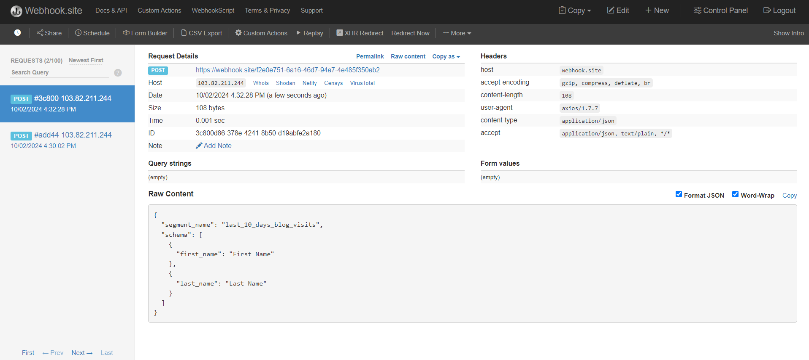

Here’s a sample README file for your project that describes how to send data to a server using Axios and Webhook.site. You can modify it according to your project specifics.

```markdown
# Send Data to Server via Webhook

This project demonstrates how to send data from a frontend application to a server using Axios and a webhook URL provided by [Webhook.site](https://webhook.site/). 

## Table of Contents
- [Installation](#installation)
- [Usage](#usage)
- [Example Code](#example-code)
- [Testing with Webhook.site](#testing-with-webhooksit)
- [License](#license)

## Installation

1. **Clone the repository**:
   ```bash
   git clone https://github.com/yourusername/your-repo-name.git
   cd your-repo-name
   ```

2. **Install dependencies**:
   Make sure you have Node.js and npm installed, then run:
   ```bash
   npm install axios
   ```

3. **Run the application**:
   ```bash
   npm start
   ```

## Usage

1. **Get Your Webhook URL**:
   - Go to [Webhook.site](https://webhook.site/).
   - Copy the unique webhook URL that appears on the screen.

2. **Modify the Axios Request**:
   In your React application, you can use the following function to send data to the webhook URL:

   ```javascript
   import axios from 'axios';

   const sendDataToWebhook = async (data) => {
       const webhookUrl = 'https://webhook.site/abcdefg-1234-5678-90ab-cdef12345678'; // Replace with your URL
       
       try {
           const response = await axios.post(webhookUrl, data);
           console.log('Data sent successfully:', response.data);
       } catch (error) {
           console.error('Error sending data:', error);
       }
   };

   // Example data to send
   const segmentData = {
       name: "Example Segment",
       value: 42
   };

   // Call the function to send data
   sendDataToWebhook(segmentData);
   ```

## Testing with Webhook.site

1. **Run Your Code**:
   - Ensure your React app is running. When the `sendDataToWebhook` function is called, it will send the specified `segmentData` to your webhook URL.

2. **Check Webhook.site for Data**:
   - Go back to your Webhook.site tab in the browser. You should see the data appearing in real-time under the "Recent Requests" section.
   - Click on the request to view the full details, including headers and body content.

## License

This project is licensed under the MIT License - see the [LICENSE](LICENSE) file for details.
```

### Instructions to Use the README

- **Replace Placeholder Text**: Make sure to replace `https://github.com/yourusername/your-repo-name.git` with the actual URL of your repository and `abcdefg-1234-5678-90ab-cdef12345678` with your actual webhook URL when you set up the project.

- **Add Additional Sections**: If your project has more features or components, consider adding sections for installation instructions, additional features, or troubleshooting tips.

Feel free to adjust the content to match the details of your project more closely! If you need any further modifications, let me know.

